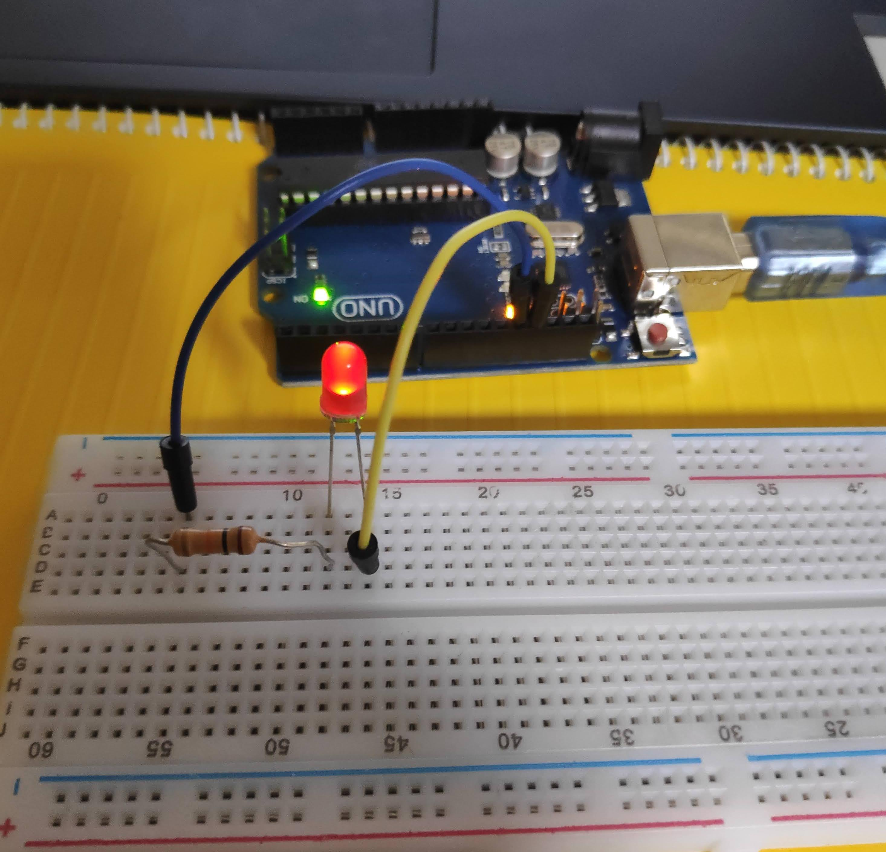

# 아두이노 노트


## lesson 01 - 시작하기

**IDE설치, 설정**

공식 사이트에서 `linux64 ~tar.xz` 압축파일을 다운받고, 압축을 푼다.
압축푼 폴더를 jimin 즉, 사용자 디렉토리에 넣는다. 

> 사용자명 폴더에는 Desktop 같은 애들이 있다. 잘 확인하고, 여기에 폴더를 두어야함.

터미널로 압축 푼 폴더에 들어간다.
그리고 터미널에 아래 명령을 준다.

```shell
$ ./install.sh
# sudo는 절대 붙이지 않는다. 
```

그럼 설치끝.

하지만, 이렇게만 하면 아두이노에 코드를 올릴 수 없다. 
권한설정을 해줘야 한다. 

```shell
jimin@fossa:~$ ls -l /dev/ttyACM*
crw-rw---- 1 root dialout 166, 0  9월  1 01:07 /dev/ttyACM0
jimin@fossa:~$ sudo usermod -a -G dialout jimin
[sudo] jimin의 암호: 
jimin@fossa:~$ 
```

그리고 컴터 다시시작.
그럼 모든 설정 완료.

**LED깜빡이기**

코드를 업로드하기 전에는 보드를 리셋해야한다. 
보드의 빨간버튼을 누르면 된다.

```c++
void setup() {
// 처음에 한번만 실행되는 코드
}

void loop() {
// 반복되는 코드
}
```

ide에서 `Tools - port`에서 연결된 아두이노를 볼 수 있다.

```c++
void setup() {
    pinMode(13, OUTPUT); 
    // 아두이노의 13번 핀을 이용한다. 그리고 그건 OUTPUT이다.
    // 13번 핀은 보드에 기본으로 내장된 LED에 연결되어있다. 
}

void loop() {
    digitalWrite(13, HIGH);
    // HIGH: LED가 켜진다. 
    // LOW: LED가 꺼진다.
}
```

깜빡이게 하기 위해서는 `HIGH`와 `LOW`중간에 딜레이가 있어야한다. 

```c++
void setup() { 
  pinMode(13, OUTPUT);
}

void loop() {
  digitalWrite(13, HIGH);
  delay(50);
  digitalWrite(13, LOW);
  delay(50);
}
```


## lesson 02 - LED 이해하기

- 전구: 와이어에 전기가 흐르면 빨간 빛을 낸다. 더 흘려보내면 하얀 빛을 낸다.
  이건 빛을 내지만, 엄밀히 열을 낸다. 에너지 낭비가 심함. (95%가 열, 5%가 빛)
- 도체: 전자가 원자가띠-전도띠(conduction band-valence band) 사이를 자유롭게 오가면서 전도성이 큰 물질.
- 부도체: 원자가띠-전도띠가 도체처럼 겹쳐지지 않고, 틈이 크기때문에 전자가 오갈 수 없다. (전도성이 작아진다.)
- 반도체: 전류를 흘려주는 방향에 따라, 도체가 되기도 하고 부도체가 되기도하는 물질.

- LED: Light Emitting Diode, 빛을 내는 반도체 소자.


> 웨이퍼(wafer):  집적회로 제작을 위해 실리콘 반도체 소재를 얇게 깎아 만든 기판.
> 집적회로(integrated Circuit): 반도체로 만든 전자회로의 집합.

전자는 에너지를 가진다. 
전자는 에너지 밴드에 속해야한다.

실리콘은 전자가 잘 묶여있다. (conduction-band는 텅비고, valence-band는 꽉 차있다.)

전자는 물이 아래로 흐르듯, 낮은 밴드(Valence Band)에 속하려 한다(에너지를 방출 하고자 한다).

전기를 흘려보내면, 마치 물이 담긴 그릇을 기울이는 것처럼 밴드의 전자를 움직이게 한다. 
하지만, 실리콘은 valence band는 꽉차고, conduction band는 텅비어서, 전자가 움직일 수 없다.(=전기가 흐를 수 없다.)

이때 온도를 높이면, 운 좋은 전자 몇개가 conduction 밴드로 점프한다.
그럼, 텅 비었던 conduction밴드에는 몇 개의 전자가 생기고, 꽉 차있던 valence밴드에 몇 개의 구멍이 생기게 된다.
이런 상태에서 전기를 흘려서 기울이게 되면, 전자가 드디어 움직인다.(=전기가 흐른다.)

이런 순수한 물질인 실리콘에 불순물 원자(donor)를 넣는다. (이 불순물 원자는 여분의 전자를 가지고 있다.)
이 원자들은 conduction밴드 근처에 위치하며 여분의 전자를 conduction밴드로 donate 한다.    
그래서 conduction밴드는 쉽게 전자를 얻게 된다. (이동할 수 있는 전자를 가지게 된다.) 
valence밴드는 여전히 꽉차서 전자가 못 움직인다. 

이러한 conductor(전도체)를 n타입이라고 한다. n은 전자를 뜻한다.
**n타입에서 전도는 전자에 의해 일어난다.**

반대로, 여분의 전자가 아닌, 부족한 전자를 가진 불순물(acceptor)을 valence밴드 근처에 위치시켜보자. 
그럼 꽉찬 valence밴드에 있는 전자가 불순물 원자로 이동하게 되면서 밴드에 구멍이 생기게 된다. 

**이것이 p타입이다. 이 물질에서 전도는 구멍(홀)을 통해 일어난다.** 

n-타입 물질과 p-타입 물질을 접합한다. 
두 물질에는 에너지 밴드차이가 있어서 낮은 준위의 n타입 conduction밴드의 여분의 전자는 높은 준위의 텅빈 p타입의 conduction밴드로 이동할 수 없고, 
p-타입의 구멍은 n-타입으로 이동할 수 없다.
쉽게 말해, 에너지 베리어에 막혀서 전자와 구멍이 n-p물질 사이를 이동할 수 없다. 
이때 전압을 걸어준다. (-를 n에, +를 p에)

> 아마도, -는 전자를 공급, +는 전자를 빼가는 역할을 하는 듯, 그래서 전자가 남는 n-타입에 전자는 더 공급하고, 구멍이 몇개 있는 p-타입에는 구멍을 더 만들고..
> 그래서 에너지 준위를 맞추는 것 같다. 

아무튼, 그렇게 에너지 밴드 차이를 낮추게 되고, 전자와 구멍이 이동할 수 있게 된다. 
n-타입의 여분의 전자가 p-타입의 conduction밴드로 이동하고, 그 전자는 다시 valence밴드로 내려오게 된다. 
이때 전자는 에너지를 뿜는데, 이 과정에서 나오는 게 photon(광자)이다.

전압을 더 높이면, 에너지 베리어가 더 낮아지면서 전자와 구멍이 더 많이 이동을 하고, 광자가 더 많이 뿜어져나오면서 더 밝아진다. 

그리고 이때 나오는 빛의 색은 재결합이 일어날때 전자가 이동한 밴드 갭의 크키가 결정한다. 
갭이 크면 더 큰 에너지를 가진 빛(자외선) 이 나오고, 갭이 작으면 에너지가 작은 빛(적외선) 이 나온다.
따라서 원하는 빛이 있다면, 그 만큼의 밴드갭을 가진 물질을 만들면 된다.  

이것이 LED가 작동하는 방식이다. 

근데 반대로 -를 p에, +를 n에 연결하게 되면, 에너지 베리어를 높이게 된다. 
그럼 전자나 구멍은 이동을 못한다.

이게 다이오드가 한 방향으로 전기를 흘리는 방법이다. 
제대로 연결해야 전기가 흐른다. 

하나더.
전압과 전류는 비례한다. 
그 이유는 전압을 높이면, 에너지 베리어가 낮아지게 되고 그래서 전자나 구멍이 더 잘 이동하게 되고, 
이걸 전류량이 많아진다. 

하지만, 다이오드에서는 전압이 양의 방향일 때(제대로 연결했을 때는) 그에 비례해서 전류도 높아지지만, 
음의 값일 때 전류는 0 이 된다. 
그리고 다이오드의 전압에 대해 전류는 제곱함수 그래프를 그린다. (전압이 높아질 수록, 흐르는 전류도 빠르게 커진다는 뜻.)
그래서 높은 전압에 다이오드를 다이렉트로 연결하면 다이오드가 탈 수 있다.  

## lesson 03 - 빵판

**빵판의 구조**

빵판의 긴부분을 옆으로 해서 두었을 때,

아래 위 두 부분으로 나뉜 것을 볼 수 있다.
각 부분의 세로로 나란한 구멍들은 연결되어있다.
하지만, 두 부분으로 나눠진 부분은 연결되지 않는다. 

옆으로 나란한 구멍들은 연결되지 않았다. 

아래위에 보면 +, - 로 표시된 긴 부분의 가로로 모든 구멍이 연결되어 있다. 


**회로구성 실습**

> 아두이노의 1~13 번 핀이 전압을 준다. ( + )
> GND 핀은 ( - ) 이다. 
>
> 회로를 구성할때, 저 두 핀을 사용한다. 
>
> LED의 긴 다리가 p, 짧은 다리가 n이다. p가 +, n이 -에 연결되어야 한다. 

아래와 같이 회로를 구성하고, 아래 코드를 넘겨보자.



```c++
void setup() {
  pinMode(13, OUTPUT);
}
// 핀 번호는 1~13 중 아무거나 상관없다. 선을 연결한 핀을 넣어주면 된다. 
void loop() {
  digitalWrite(13, HIGH);
  delay(900);
  digitalWrite(13, LOW);
  delay(100);
}
```

그럼 LED가 깜빡인다!!

> 숙제
>
> LED 3개를 다른 주기로 깜빡이게 하기.


빵판의 최상단 길게 행으로 연결된 곳에 GND를 넣어서 받게 했다. 

```c++
void setup() {
  pinMode(13, OUTPUT);
  pinMode(12, OUTPUT);
  pinMode(11, OUTPUT);

}

void loop() {
  digitalWrite(13, HIGH);
  delay(900);
  digitalWrite(13, LOW);
  delay(100);
  digitalWrite(12, HIGH);
  delay(90);
  digitalWrite(12, LOW);
  delay(10);
  digitalWrite(11, HIGH);
  delay(500);
  digitalWrite(11, LOW);
  delay(500);
}
```

이제 빵판을 어떻게 쓰는지 알겠슴다. 

## lesson 04 - 변수

. . . ㅡ ㅡ ㅡ . . .

위의 모스부호는 SOS를 의미한다. 
이걸 LED로 나타내는 방법은 간단하다. 

루프 함수 안에 다 - 넣어주면 된다.

```c++
digitalWrite(8, HIGH);
delay(50);
digitalWrite(8, LOW);
delay(50); // 이걸 3번 반복해서 쓰고,
// ...
digitalWrite(8, HIGH);
delay(500);
digitalWrite(8, LOW);
delay(50); // 이것도 3번 반복
// ...
digitalWrite(8, HIGH);
delay(50);
digitalWrite(8, LOW);
delay(50); // 또 3번
// ...
```

넘나 비효율적이다. 

```c++
int led = 8;
int st = 100;
int lg = 500;
int tm = 150;
int looptm = 1000;

void shortSignal() {
  digitalWrite(led, HIGH);
  delay(st);
  digitalWrite(led, LOW);
  delay(tm);
}

void longSignal() {
  digitalWrite(led, HIGH);
  delay(lg);
  digitalWrite(led, LOW);
  delay(tm);
}

// setup(), loop() 함수전에 필요한 애들을 먼저 정의하고, 함수안에서는 가져다 쓰기만 한다.
void setup() {
  pinMode(led, OUTPUT);
}

void loop() {
  shortSignal();
  shortSignal();
  shortSignal();
  longSignal();
  longSignal();
  longSignal();
  shortSignal();
  shortSignal();
  shortSignal();
  
  delay(looptm);
}
```

- setup(), loop() 안에서 쓸 값, 함수는 밖에서 미리 정의를 하자.


## lesson 05, 06 - 바이너리

디지털 디바이스는 스위치의 집합, 켜지면 1, 꺼지면 0.
음악, 색깔, 텍스트 모두 숫자로 바꿀 수 있다. 
이것이 컴퓨터가 0, 1로 세상을 이해하는 방식이다. 

십진법은 0, 1, 2, ... 9 까지의 부호가 있다. 
그리고 10이라는 숫자를 표현해야할때, 자릿수를 늘린다. 

이진법은 0, 1 두개 뿐이다. 표현한는 방법은 이미 잘 알고 있으니 패스.

이진법을 1부터 쭉 나열하면 규칙이 보인다. 
첫째자리는 1, 0의 반복
둘째자리는 11, 00의 반복
셋째자리는 1111, 0000의 반복
왜냐하면 각 자리는 1, 2, 4, 8, 16 의 값을 가지니까.

십진법의 각 자리는 1, 10, 100 의 값을 가짐. 

그리고 아두이노나 컴퓨터의 실리콘안에 있는 것이 0, 1을 위한 스위치들이다. 

**LED 바이너리 카운터 만들기**

1~15까지의 십진법 숫자를 바이너리로 LED를 통해 출력되도록 하는 것이 숙제였다. 
그냥 1~15를 0001, 1111까지 배열에 저장해서 해도 되지만, 난 직접 이진법으로 변환을 하고 싶었다. 

근데 C언어가 익숙하지 않아서, 완성하지 못했다. 
나중에는 꼭 직접 인풋을 받아서, 변환한 바이너리를 출력하는 완성도 있는 애를 만들어보자!

아래는 바이너리 값을 다 저장해서 만든 프로그램.

```c++
int pin = 8;
int wait = 500;
int bin[15][4] = {
  {0, 0, 0, 1},
  {0, 0, 1, 0},
  {0, 0, 1, 1},
  {0, 1, 0, 0},
  {0, 1, 0, 1},
  {0, 1, 1, 0},
  {0, 1, 1, 1},
  {1, 0, 0, 0},
  {1, 0, 0, 1},
  {1, 0, 1, 0},
  {1, 0, 1, 1},
  {1, 1, 0, 0},
  {1, 1, 0, 1},
  {1, 1, 1, 0},
  {1, 1, 1, 1},
};

void setup() {
  for (int p = 0; p < 4; p++) {
    pinMode(pin + p, OUTPUT);
  }
}

void loop() {
  for (int i = 0; i < 15; i++) {
    for (int j = 0; j < 4; j++) {
      if (bin[i][j] == 1) {
        digitalWrite(pin + j, HIGH);
      } else {
        digitalWrite(pin + j, LOW);
      }
    }
    delay(wait);
    for (int k = 0; k < 4; k++) {
      digitalWrite(pin + k, LOW);
    }
    delay(wait);
  }
}
```

요렇게 단순하게 코딩하고, 

핀 8, 9, 10, 11 에 LED와 저항을 각각 연결해서 배열의 값이 1 이면 켜지게 했다.

- LED나 저항을 같은 열에 연결하면 안된다. 2개 다리를 각각 다른 열에 연결해야함.
- 왜냐하면 Row(열) 끼리는 연결되어 있지 않기때문에, 다리를 통해서 연결해야함.
- 그리고 저 아래위 판이 분리된 것을 활용해서 저항을 세로로 연결, 아래와 같이 깔끔하게 회로를 구성할 수 있다.


## lesson 07 - analogWrite

지금까지 배운 아두이노 명령은,  LED를 켜고, 끄는 것이 전부였다.
0 과 1, 즉 digitalWrite() 만 이용했다. 

켜고 끄는 사이의 값을 주는 명령은 analogWrite() 이다.  

analogWrite 명령은 ~ (물결) 표시가 있는 pin만 가능하다. (3, 5, 6, 9, 10, 11)

```c++
void setup(){
    pinMode(9, OUTPUT);
    // 3, 5, 6, 9, 10, 11핀만 analogWrite가 가능하다. 
}
void loop(){
    analogWrite(핀, 숫자);
    // 숫자는 0 ~ 255 의 범위를 가진다. 
}
```

- 0 은 0 볼트
- 255 는 255볼트가 아니라, 5볼트이다. 

숫자의 범위는 0~255 까지, 8bit 즉 1바이트의 값이 가능하다.  
이것은 0~5볼트에 대응한다.


## lesson 08 - PWM

Pulse Width Modulation(펄스- 폭 - 변조)

강의에서는 오실로스코프를 회로에 연결해서 흐르는 전압을 측정할 수 있게 하였다. 

오실로스코프를 통해서 analogWrite의 값에 따라서 전압이 변하는 것을 볼 수 있다. 
여기서 재밌는것은, 0과 255는 일직선으로 나오는 것에 반해서, 
그 사이 값들은 0과 255 값들의 반복으로 나온다. 

그 이유는 예를 들어, 127을 넣으면 아두이노가 딱 저만큼의 전압을 흘려주는 것이 아니라, 
0과 255를 반반씩 반복하면서 그 사이값인 127을 평균적으로 만들어내는 것이다. 

그래서 10을 넣으면, 0을 더 오래 반복하고, 200을 넣으면 255인, 5볼트 전압을 더 오래 유지하게 된다.
반복되는 주기는 언제나 같지만, 
주어진 전압에 따라서 한주기 안에서 0과 5v가 차지하는 비율이 변하는 것이다.

그런 식으로 아날로그 값을 준다. 
결국 아날로그도 디지털의 빠른 반복으로 만들어내는 것이다.

그리고, 이걸 평균값으로 만들어주는 소자가 있다. 
그것이 바로, capacitor, condensor, 축전기로 불리는 장치이다. 

이걸 회로에 연결하고, 오실로스코프를 보면, 0과 255를 넘나드는 그래프가 
그 사이 값을 가진 일직선으로 부드럽게 바뀐다.

> 아두이노에 analogWrite는 키고 끄고를 반복해서 사이값을 만들어내는 것이다. 
> 콘덴서, 케퍼시터는 이런 반복을 부드럽게 바꿔준다.


## lesson 09 - 옴의 법칙

물의 흐름에 비유를 하자면, 
전압은 수압, 물의 압력이고.
전류는 흐르는 물이라고 볼 수 있다. 

그래서 회로도에서 v 부분은 펌프정도로 생각하면 된다. 
압력이 높으면(볼트가 높으면), 물이(전기가) 많이 흐른다. 

그리고 저항은 물이 흐르는 파이프의 관을 좁히는 장애물로 볼 수 있다. 
당연히 파이프가 좁아지니 물은 덜 흐르게 되고, 압력은 높아질 수 밖에 없다. 

이것이 옴의 법칙이다.
물의 흐름으로 생각해보면, 아주 당연한 **3가지 값의 관계**이다.  

```
전압 = 전류 * 저항
// V = IR
```

그래서 회로에서 두 가지값을 알면 나머지 한 값을 알 수 있다.

> 전류는 + 에서 나온다. 
> 근데 전자는 - 에서 나온다. 

직렬로 저항이 연결되어 있으면, 
그냥 두 저항을 더하면 된다.
그럼 전체 회로에 흐르는 전류가 나온다. 

그리고 각각의 저항에 걸리는 전압을 그 저항*전류 로 구할 수 있다. 
그리고 그 두 전압을 더하면, 총 전압이 나온다.   

이걸 전압계로 측정할 수 있다. 
빵판에 직접 저항 두개로 간단한 회로를 만든다. 

> 아두이노에는 항상 5v 를 공급하는 핀이 있으니 거기에 연결하면 됨.

그리고 전압계를 회로 사이 적절하게 꽃아주면 계산한 전압값을 실제로 볼 수 있다.

> 한 회로 안에서 전류는 일정한데, 전압이 다르다는 것은 뭔가 이상하게 들린다. 
> 다시, 물의 흐름에 비유하자면, 흐르는 물의 양은 일정하지만, 관이 좁아지고 넓어지고에 따라서 구간마다 수압이 달라지는 것으로 비유할 수 있다. 

## lesson 10 - analogRead

digitalWrite, analogWrite 모두 아두이노에게 신호를 보내기만 했다. 
이번에는 반대로 아두이노로부터 신호를 읽어들이는 것에 대해서 알아본다.

값을 읽을 때는 A1~5 핀을 써야한다.
그리고 출력값은 실제전압은 아니다.

실제 전압이 0 이면 0,
5면 1023이 나온다. 

일단, 아래와 같이 코딩을 해서 출력값을 보자.

```c++
int readPin = A3;
int V2 = 0;
int delayTime = 500;

void setup() {
  pinMode(readPin, INPUT);
  Serial.begin(9600);
}

void loop() {
  V2 = analogRead(readPin);
  Serial.println(V2);
  delay(delayTime);
}
```

모니터를 열면, 전압의 정확한 값이 나오는 게 아니라.
0 - 5 사이를 1023로 나눠져 있고, 측정값을 그 사이에 놓았을 때 대응하는 수가 출력되는 것이다. 

> 아두이노는 (2^10)인, 10bit로 결과를 출력할 수 있다.  0~ 1023

즉, 나온값을 1023으로 나누고, 5를 곱하면 전압을 구할 수 있다. 

```c++
int readPin = A3;
int readVal;
float V2 = 0;
int delayTime = 500;

void setup() {
  pinMode(readPin, INPUT);
  Serial.begin(9600);
}

void loop() {
  readVal = analogRead(readPin);
  V2 = (5./1023.)*readVal;
  Serial.println(V2);
  delay(delayTime);
}
```

```c++
V2 = (5./1023.)*readVal;
```

5/1023을 하면 `int`로 계산을 해버려서 `V2`는 항상 0 이 되버린다. 
그래서 소수가 나올 수 있도록 소수끼리 나눠주는 것이다. ( 숫자 끝에 쩜을 더해주면 float로 인식을 한다.)

그리고 모니터를 보면 계산된 전압값이 나온다. 

> 아두이노로 전압을 읽는 것을 배웠다. 

## lesson 11 - Serial

핀을 쓰기 위해서는 pinMode() 를 setup() 에서 불러줘야한다. 
Serial모니터를 쓰기위해서도 setup()에서 불러줘야 한다. 

설정은 `baud rate`라고 하는 통신속도를 정해주면 된다.
중요한건, 코드에서 정한 속도하고, 모니터의 속도가 일치해야한다.

```c++
int j = 1;
int waitT = 750;
String myString = "j = ";

void setup() {
    // Serial.begin(baud rate) => 시리얼 통신 속도이다. 
  Serial.begin(9600);
}

void loop() {
  // print() 는 줄바꿈을 안한다. println() 은 출력하고 줄을 바꾼다.
  Serial.print(myString);
  Serial.println(j); 
  j = j + 1;
  delay(waitT);

}
```

- 함수에서 쓸 값은 초기에 변수에 저장한다. 
- 보기좋게 출력을 한다.

```c++
int j = 1;
int waitT = 750;
float area;
float pi = 3.14;
float r = 2;
String m1= "A Circle With Radius ";
String m2 = " Has a Area of ";
String m3 = ".";

void setup() {
  Serial.begin(19200);
}

void loop() {
  area = pi * r * 2;
  Serial.print(m1);
  Serial.print(r);
  Serial.print(m2);
  Serial.print(area);
  Serial.println(m3);
  delay(waitT);
  r = r + .5;
}
```

```
시리얼 모니터
A Circle With Radius 96.50 Has a Area of 606.02.
A Circle With Radius 97.00 Has a Area of 609.16.
A Circle With Radius 97.50 Has a Area of 612.30.
...
```

## lesson 12 - Potentiometers

Potentiometers = 가변저항
말 그래로 값이 고정되지 않고 바꿀 수 있는 저항이다. 다리가 3개인 것이 특징.

원리는 그림을 보면 한방에 이해된다. [네이버 블로그의 설명](https://m.blog.naver.com/haneham/221235789444)

최대 저항값이 아두이노 킷에 있는 거는 10,000옴이다. 0~10K 까지 조절가능.

3개 다리를 빵판에 연결하고 LED를 넣어서 밝기 조절이 되게 만들 수 있다. 
그리고 11강에서 배운대로 하면, LED에 걸리는 전압도 모니터로 볼 수 있다. 

> 근데 아직도 전압을 측정할때, 어디에 꽃아야 되는 건지 이유를 잘 모르겠음.

## lesson 13, 14 - if

아두이노에는  ground 핀이 3개 였음. A~ 있는데 하나더 있더라. 

이번 시간에는 if를 배우기 위해서 지난 시간에 배운 가변저항을 이용했다. 
가변저항을 조절하면서 전압에 따라 서로 다른 LED가 켜지게 하는 방식.

조건에 따라 다른 코드를 실행하는 if를 배우는 아주 좋은 방법같다. 

```c++
if(a>2 && a<5){
    // a가 2~5사이 숫자일때 실행됨. 
}else if(a==6 || a==7){
    // a가 6또는 7일때 실행됨.
}
// ==
// !=
// &&
// ||
```

가변저항에 선을 연결할때 변하는 저항값을 읽기 위해서는 

- 첫번째 다리를 5v전압에
- 가운데 다리는 읽을 핀에 (A~)
- 마지막 다리는 Ground 연결한다.

읽은 전압에 따라서 red, yel, gre이 켜지는 회로


```c++
int red = 8;
int yel = 9;
int gre = 10;
int readPin = A5;
float volt;
int waitTime = 500;

void setup() {
  pinMode(red, OUTPUT);
  pinMode(yel, OUTPUT);
  pinMode(gre, OUTPUT);
  pinMode(readPin, INPUT);
  Serial.begin(9600);
}

void loop() {
  volt = (5./1023.)*analogRead(A5);
  Serial.println(volt);
  digitalWrite(gre, LOW);
  digitalWrite(yel, LOW);
  digitalWrite(red, LOW);
  if(volt<2){
    digitalWrite(gre, HIGH);
  }
  if(volt>2 && volt <4){
    digitalWrite(yel, HIGH);
  }
  if(volt>4){
    digitalWrite(red, HIGH);
  }
  delay(waitTime);
}
```

그리고, 읽은 전압에 따라서 LED 밝기를 조절하는 회로


```python
int pin = 9;
int readPin = A5;
float val;
int waitTime = 500;

void setup() {
  pinMode(pin, OUTPUT);
  pinMode(readPin, INPUT);
  Serial.begin(9600);
}

void loop() {
  val = (255./1023.)*analogRead(A5);
  Serial.println(val);
  analogWrite(pin, val);
}
```

## lesson 15, 16, 17 - loop

빨간거 3번, 노란거 5번 깜빡이는 회로, 코드 짜기 

for 문에 대해서 배움.

```c++
int red = 8;
int yel = 9;
int redBlink = 3;
int yelBlink = 5;
int wait = 100;
void setup() {
  pinMode(8, OUTPUT);
  pinMode(9, OUTPUT);
}

void loop() {
  for (int i = 0; i < redBlink; i++) {
    digitalWrite(red, HIGH);
    delay(wait);
    digitalWrite(red, LOW);
    delay(wait);
  }

  for (int i = 0; i < yelBlink; i++) {
    digitalWrite(yel, HIGH);
    delay(wait);
    digitalWrite(yel, LOW);
    delay(wait);
  }
  delay(2000);

}
```

while문에 대해서도 배움.

1~10까지 출력하기.

- for 문은 반복의 횟수를 알때.
- while문은 반복의 횟수를 모를때.

```c++
int j;
int wait = 100;

void setup() {
  Serial.begin(9600);
}

void loop() {
  j = 1;
  while(j<=10) {
    Serial.println(j);
    delay(wait);
    j++;
  }
}
```

가변저항으로 회로를 구성하고, 
전압을 while 루프의 조건으로 한다. 

그래서 특정 전압 이상이면 led를 킨다. 

중요한건, **while루프 안에서 계속 조건을 업데이트 해야한다는 것.**

while루프가 이런거 만들때 for문에 비해서 많이 쓰이는 이유가, 
이런 고정되지 않은 조건에 대해서 반복을 하게 할 수 있기 때문에 그렇다.

```c++
int pin = 8;
int apin = A5;
int readValue;
int wait = 200;

void readfn() {
  readValue = analogRead(apin);
  Serial.println(readValue);
  delay(wait);
}
void setup() {
  pinMode(apin, INPUT);
  pinMode(pin, OUTPUT);
  Serial.begin(9600);
}

void loop() {
  readfn();

  while (readValue > 1000) {
    digitalWrite(pin, HIGH);
    readfn();
  }
  digitalWrite(pin, LOW);
}

```

